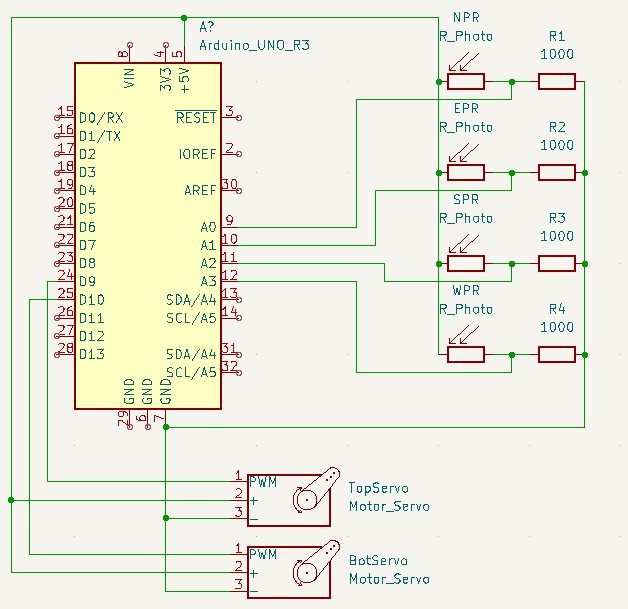

# Servolab solcellepanel
Dette er et forslag til laboppgave om et solcellepanel som flytter seg selv ut ifra lysstyrke.
Solcelle styres av arduino sitt servo-bibliotek

Koden fungerer ved at man bruker fire fotoresistorer til å måle lysstryken fra fire forskjellige vinkler:
Disse kaller vi North, South, East og West, hvor om koblet med lik rekke som pins (A0:N, A1:W, A2:S, A3:E) vil de peke som et kompass.
Solcellen er styrt av to servo-motorer, en som ligger på siden, over den andre. 

Servoen på topp styres basert på North/East mot South/West.
Servoen på bunn styres basert på North/West mot South/East.

Vi benytter en 3D printet del for å lage skillevegger mellom fotoresistorene.

# Oppkobling:

# Deler:
## Servo:
Vi benytter oss av to servoer av typen [SM-S2309S](http://descargas.cetronic.es/microservo.pdf)

## 3D-printet del:
